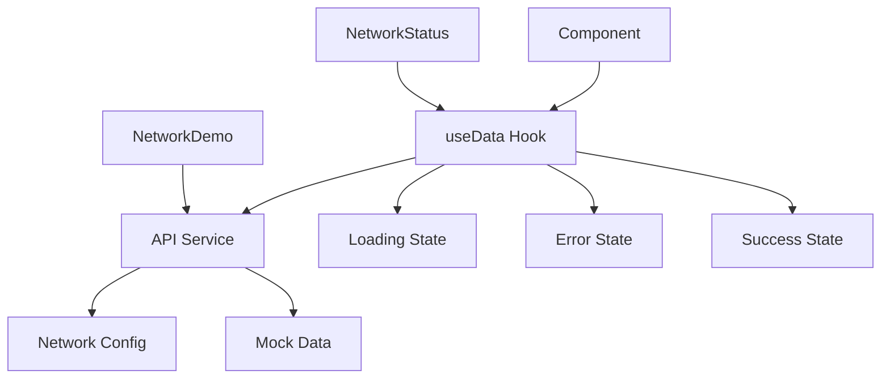

# Network Simulation System

This document describes the network simulation system implemented to prepare the application for real network requests.

## Overview

The network simulation system provides:

- Realistic network delays and error simulation
- Configurable network behavior
- Loading states and error handling
- Development tools for testing network scenarios

## Architecture

### 1. Data Layer (`/src/services/api.ts`)

- **Mock API Service**: Simulates REST API endpoints
- **Network Delays**: Configurable response times (200-800ms default)
- **Error Simulation**: Random network failures with configurable rates
- **Request Logging**: Development logging of all API calls

### 2. Configuration (`/src/config/network.ts`)

- **Network Settings**: Delay ranges, error rates, UI behavior
- **Development Modes**: Force errors, slow network simulation
- **Operation-Specific Config**: Different settings for GET/POST requests

### 3. Data Hooks (`/src/hooks/useData.ts`)

- **useReviews()**: Manages review data with network state
- **useTestimonials()**: Handles testimonials with loading/error states
- **useAllTestimonials()**: Combines testimonials and user reviews

### 4. UI Components

- **LoadingStates**: Spinner, skeleton screens, error states
- **NetworkStatus**: Global network activity indicator
- **NetworkDemo**: Development tool for testing network scenarios

## API Endpoints Simulated

### Reviews API

```typescript
GET    /api/reviews          // Fetch all reviews
POST   /api/reviews          // Submit new review
PUT    /api/reviews/:id      // Update existing review
DELETE /api/reviews/:id      // Delete review
```

### Testimonials API

```typescript
GET / api / testimonials; // Fetch testimonials
```

## Network Configuration

```typescript
const networkConfig = {
  enabled: true,
  delays: {
    min: 200, // Minimum delay (ms)
    max: 800, // Maximum delay (ms)
    post: { min: 500, max: 1200 }, // Longer for POST requests
  },
  errorRates: {
    fetchReviews: 0.05, // 5% error rate
    submitReview: 0.08, // 8% error rate
    // ... other operations
  },
  dev: {
    logRequests: true, // Console logging
    forceErrors: false, // Force all requests to fail
    forceSlowNetwork: false, // Force 2-5s delays
  },
};
```

## Usage Examples

### Basic Data Fetching

```typescript
const { reviews, loading, error, submitReview } = useReviews();

// Handle loading state
if (loading) return <LoadingSpinner />;

// Handle error state
if (error) return <ErrorState message={error} />;

// Use data
return <ReviewList reviews={reviews} />;
```

### Submitting Data

```typescript
const handleSubmit = async (reviewData) => {
  try {
    await submitReview(reviewData);
    toast.success("Review submitted!");
  } catch (error) {
    toast.error("Failed to submit review");
  }
};
```

## Migration to Real API

When migrating to a real backend API:

1. **Update API Service** (`/src/services/api.ts`):

   ```typescript
   // Replace mock functions with real fetch calls
   async fetchReviews(): Promise<Review[]> {
     const response = await fetch('/api/reviews');
     return response.json();
   }
   ```

2. **Remove Simulation** (`/src/config/network.ts`):

   ```typescript
   const networkConfig = {
     enabled: false, // Disable simulation
     // ... rest of config
   };
   ```

3. **Keep UI Components**: All loading states and error handling remain the same

## Development Tools

### Network Demo Widget

- Located in bottom-right corner during development
- Test different network scenarios
- Toggle error simulation and slow network modes
- View real-time API call logs

### Console Logging

All API calls are logged with:

- Operation name and duration
- Success/failure status
- Error messages when applicable

### Error Testing

- Enable `forceErrors: true` to test error handling
- Enable `forceSlowNetwork: true` to test loading states
- Adjust error rates per operation type

## Benefits

1. **Realistic Development**: Experience real network conditions during development
2. **Error Handling**: Test how the app behaves with network failures
3. **Performance**: Optimize loading states and user experience
4. **Easy Migration**: Clean separation between mock and real APIs
5. **Debugging**: Comprehensive logging and testing tools

## Data Flow



This system provides a robust foundation for handling network requests while maintaining excellent user experience through proper loading states and error handling.
